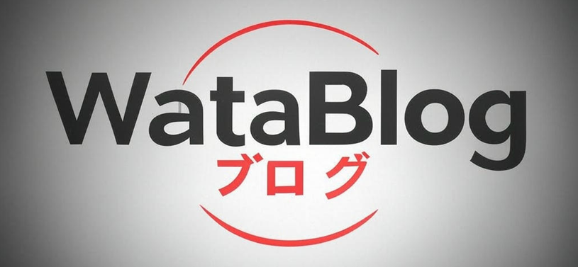
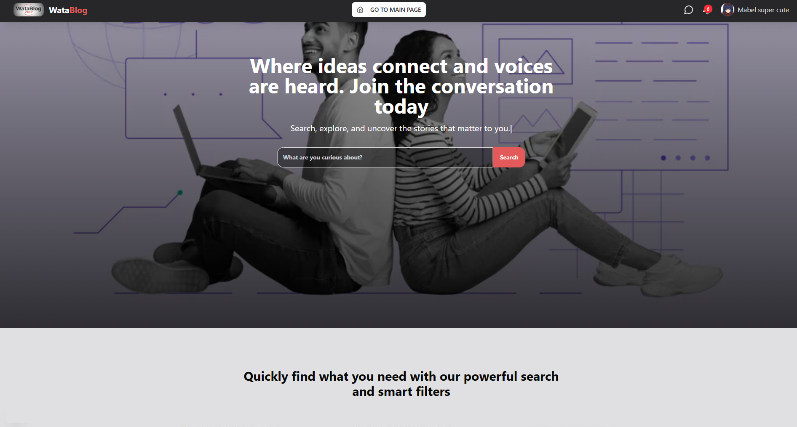
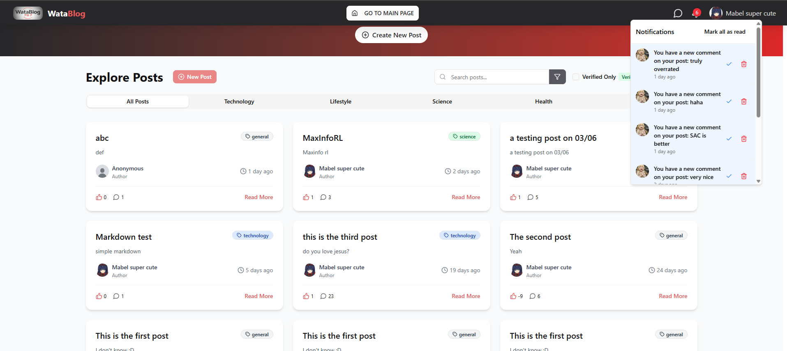
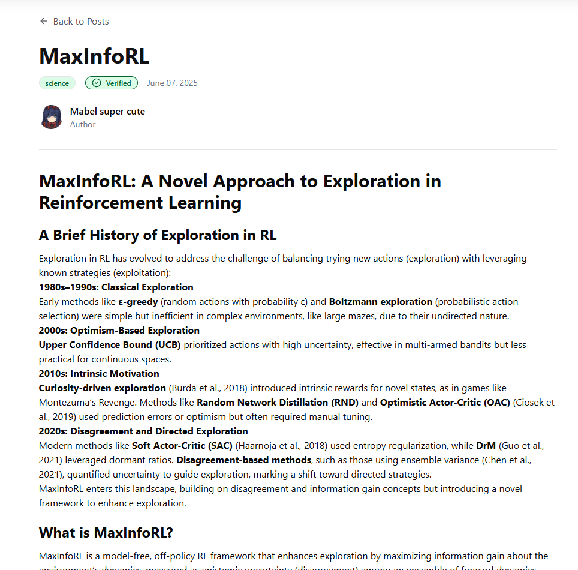
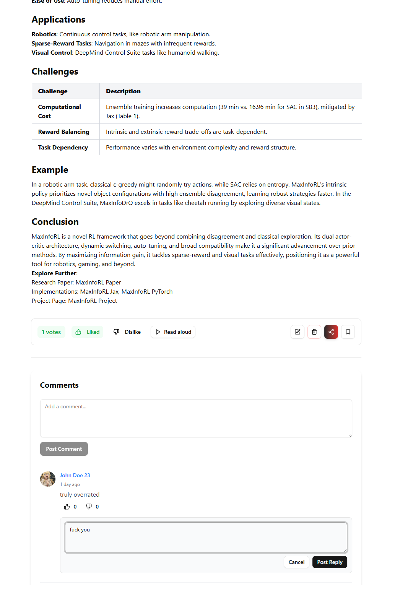
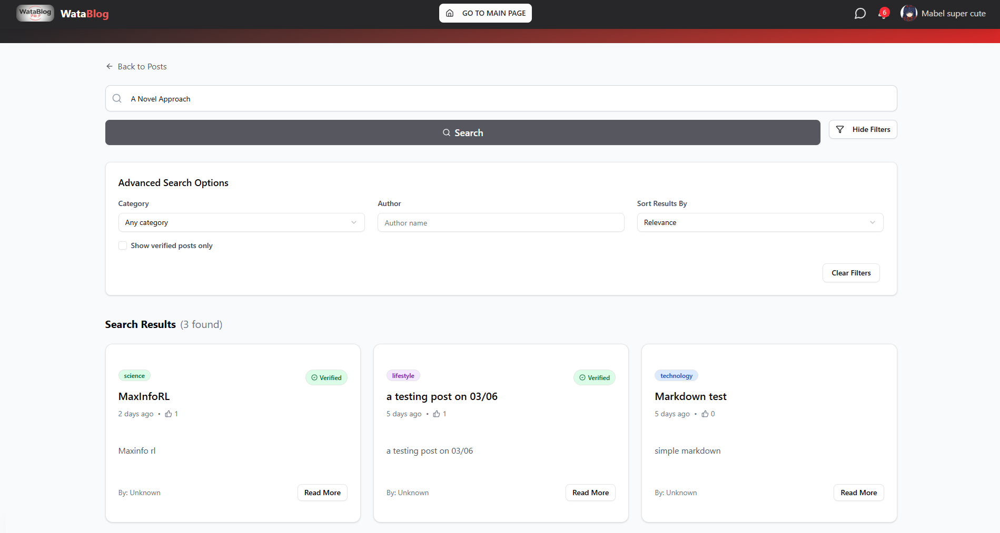
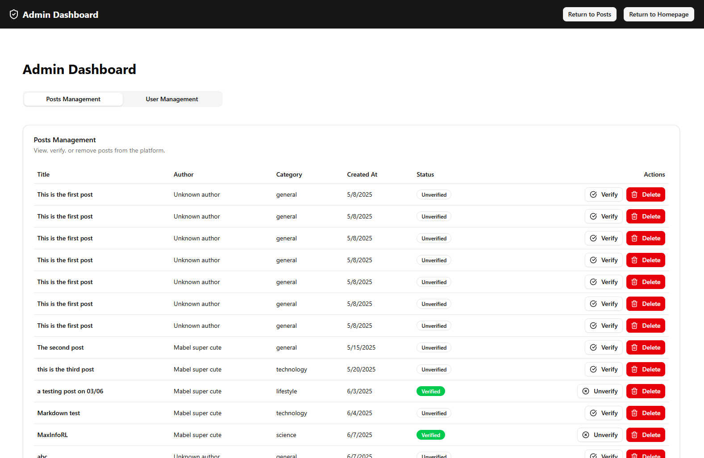

# WataBlog - Blog Forum Platform



WataBlog is a full-stack blog and forum platform designed to connect writers, readers, and enthusiasts in meaningful conversations. The platform provides a modern, feature-rich environment for creating and sharing content, engaging in discussions, and discovering new ideas.

## 📋 Table of Contents

- [Architecture Overview](#architecture-overview)
- [Key Features](#key-features)
- [Tech Stack](#tech-stack)
- [Getting Started](#getting-started)
  - [Prerequisites](#prerequisites)
  - [Installation](#installation)
  - [Running the Application](#running-the-application)
- [Project Structure](#project-structure)
- [Showcase](#showcase)
- [Contributing](#contributing)

## 🏗️ Architecture Overview

The project follows a modern microservices architecture:

1. **Next.js Frontend** (`/next-web`): Responsive web interface with server-side rendering
2. **NestJS Backend** (`/dispatch`): RESTful API service for business logic and data management
3. **Python Services** (`/services`):
   - Text-to-Speech Service: Converting blog content to audio
   - Search Service: Advanced search capabilities using BM25 algorithm

## ✨ Key Features

### User Management
- **Authentication**: Secure login and registration via Auth0
- **User Profiles**: Customizable profiles with avatars and bio
- **Follow System**: Follow other users and keep track of their content
- **Dashboard**: User statistics, analytics, and activity tracking

### Content Creation & Management
- **Rich Post Editor**: Create and edit blog posts with Markdown support
- **Categories & Tags**: Organize content by topics and tags
- **Media Embedding**: Include images and rich media in posts
- **Save for Later**: Bookmark posts to read later
- **Draft System**: Save drafts and publish when ready

### Engagement & Interaction
- **Comments & Discussions**: Engage with content through nested comments
- **Like/Dislike System**: Express reactions to posts and comments
- **Notifications**: Real-time notifications for interactions
- **Direct Messaging**: Private communication between users

### Discovery & Search
- **Advanced Search**: Find content by keywords, authors, categories, or tags
- **Personalized Recommendations**: Content suggestions based on user preferences
- **Featured Content**: Highlighting trending and popular posts
- **Text-to-Speech**: Convert blog posts to audio for accessibility

### Administration
- **Admin Dashboard**: Moderate content, manage users, and monitor platform activity
- **Content Verification**: Review and verify posts for quality
- **User Management**: Manage user accounts and permissions
- **Bulk Notifications**: Send announcements to users

## 🛠️ Tech Stack

### Frontend
- **Next.js**: React framework for server-side rendered pages
- **TypeScript**: Type-safe JavaScript
- **Redux Toolkit**: State management
- **Tailwind CSS**: Utility-first CSS framework
- **Shadcn UI**: Component library
- **Framer Motion**: Animations and transitions

### Backend
- **NestJS**: Progressive Node.js framework
- **TypeScript**: Type-safe JavaScript
- **MongoDB**: NoSQL database with Mongoose ODM
- **Passport.js**: Authentication middleware
- **JWT**: Token-based authentication

### Services
- **FastAPI**: Python API framework for microservices
- **BM25**: Search ranking algorithm
- **Text-to-Speech**: Audio conversion service
- **NLTK**: Natural Language Processing library
- **Conda**: Environment management for Python services

### DevOps
- **Docker**: Containerization
- **Redis**: Caching
- **Nginx**: Reverse proxy

## 🚀 Getting Started

### Prerequisites

- Node.js (v16+)
- Python 3.8+ with Conda
- MongoDB
- Redis (optional, for production)

### Installation

#### 1. Clone the repository
```bash
git clone https://github.com/yourusername/blog_forum_project.git
cd blog_forum_project
```

#### 2. Setup Next.js Frontend
```bash
cd next-web
npm install
```

#### 3. Setup NestJS Backend
```bash
cd ../dispatch
npm install
```

#### 4. Setup Python Services

##### Search Service
```bash
cd ../services/searching
conda env create -f environment.yml
conda activate se104-bm25-search-api
python -m nltk.downloader punkt
```

##### Text-to-Speech Service
```bash
cd ../text2speak
conda env create -f environment.yml
conda activate se104-fastapi-tts
```

### Running the Application

#### 1. Start the NestJS Backend
```bash
cd dispatch
npm run start:dev
```

#### 2. Start the Next.js Frontend
```bash
cd next-web
npm run dev
```

#### 3. Start the Python Services

##### Search Service
```bash
cd services/searching
conda activate se104-bm25-search-api
uvicorn main:app --host 0.0.0.0 --port 8000 --reload
```

##### Text-to-Speech Service
```bash
cd services/text2speak
conda activate se104-fastapi-tts
uvicorn main:app --host 0.0.0.0 --port 8001 --reload
```

Visit `http://localhost:3000` to access the application.

## 📂 Project Structure

```
blog_forum_project/
├── dispatch/              # NestJS Backend
│   ├── src/
│   │   ├── account/       # User authentication and profiles
│   │   ├── blog/          # Blog post management
│   │   ├── mailer/        # Email notification service
│   │   ├── message/       # Direct messaging system
│   │   ├── search/        # Search integration
│   │   └── utils/         # Utility functions
│   └── ...
├── next-web/              # Next.js Frontend
│   ├── public/            # Static assets
│   │   └── showcase/      # Preview images
│   └── src/
│       ├── app/           # Pages and routes
│       ├── components/    # UI components
│       ├── hooks/         # Custom React hooks
│       ├── lib/           # Utilities and configurations
│       └── utils/         # Helper functions
└── services/              # Python Microservices
    ├── searching/         # Search service
    └── text2speak/        # Text-to-Speech service
```

## 📸 Showcase

### Landing Page


### Homepage


### Article View


### Markdown and Comment Exmaple


### Search Interface


### Admin Dashboard


### Account Dashboard

### Credit System


## 🤝 Contributing

Contributions are welcome! Please feel free to submit a Pull Request.

1. Fork the project
2. Create your feature branch (`git checkout -b feature/amazing-feature`)
3. Commit your changes (`git commit -m 'Add some amazing feature'`)
4. Push to the branch (`git push origin feature/amazing-feature`)
5. Open a Pull Request

## 📄 License

This project is licensed under the MIT License - see the LICENSE file for details.

---

Built with ❤️ by Trungdangtapcode